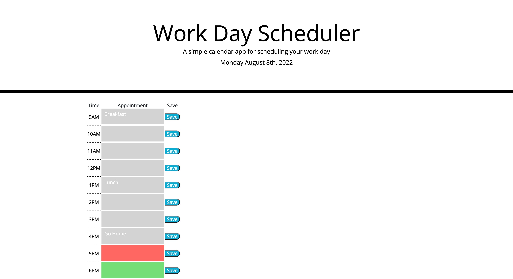

# module-5-work-day-scheduler

## Overview

To help manage my busy schedule, I created a scheduler to better manage my time.

The scheduler includes:

- Entry for text
- A save button
- Color coded timeblocks that indicate whether in past, current, or future.

## Installation:

1. `git clone git@github.com:PDKetchum/module-5-work-day-scheduler.git`
2. Open `index.html`

## How to use:

- Type in your appointment
- Click save to store in scheduler
- To remove an appointment, delete text and click save

Hosted: https://pdketchum.github.io/module-5-work-day-scheduler/

GitHub URL: https://github.com/PDKetchum/module-5-work-day-scheduler

_Screenshot of page_
